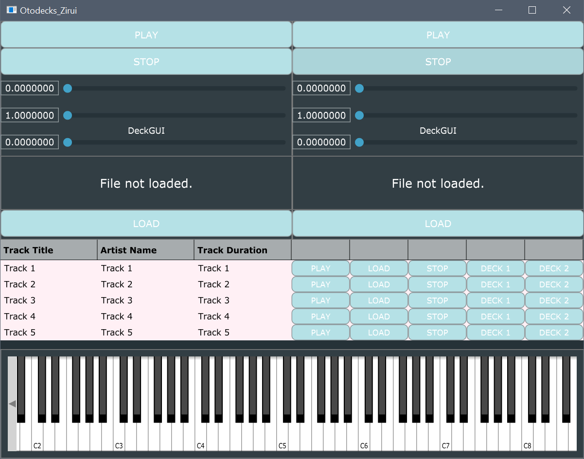

# Otodeck - DJ Audio Application



## Overview

Otodeck is a professional DJ audio application built with the JUCE framework. This application provides a comprehensive digital DJing experience with dual-deck functionality, playlist management, waveform visualization, and MIDI keyboard integration.

## Features

### 🎛️ Dual Deck System
- **Two Independent Audio Decks**: Each deck has its own set of controls for independent audio playback
- **Play/Stop Controls**: Standard playback controls for each deck
- **Volume Control**: Individual volume sliders for each deck
- **Speed Control**: Pitch/speed adjustment for beatmatching and creative effects
- **Position Control**: Seek functionality to navigate through tracks

### 📊 Waveform Display
- **Visual Waveform**: Real-time waveform visualization for loaded tracks
- **Playhead Position**: Visual indicator showing current playback position
- **Audio Thumbnail**: Efficient waveform caching for smooth performance

### 📋 Playlist Management
- **Track Library**: Table-based playlist component for organizing music
- **Drag & Drop**: Easy file loading through drag and drop functionality
- **Track Information**: Display of track titles and metadata
- **Third Player**: Dedicated audio player for playlist preview

### 🎹 MIDI Keyboard
- **Virtual Keyboard**: Built-in MIDI keyboard component for musical input
- **Synthesizer Integration**: Based on JUCE's synthesizer tutorial implementation
- **Real-time Audio**: Low-latency MIDI input processing

### 🔊 Audio Engine
- **Multi-channel Audio**: 2 input, 2 output audio configuration
- **Audio Mixing**: Built-in mixer for combining multiple audio sources
- **Format Support**: Support for various audio formats through JUCE's format manager
- **Resampling**: High-quality audio resampling for pitch/speed changes

## Technical Architecture

### Core Components

1. **MainComponent**: Main application container managing all sub-components
2. **DJAudioPlayer**: Core audio playback engine with transport controls
3. **DeckGUI**: User interface for each audio deck with controls and waveform
4. **PlaylistComponent**: Table-based playlist management interface
5. **KeyboardComponent**: MIDI keyboard interface for musical input
6. **WaveformDisplay**: Visual waveform representation component

### Audio Processing Pipeline

```
Audio Files → AudioFormatManager → DJAudioPlayer → MixerAudioSource → Audio Output
```

- **AudioFormatManager**: Handles various audio file formats
- **AudioTransportSource**: Manages playback position and transport
- **ResamplingAudioSource**: Provides pitch/speed control
- **MixerAudioSource**: Combines multiple audio sources

## Project Structure

```
Otodeck/
├── Source/
│   ├── Main.cpp                    # Application entry point
│   ├── MainComponent.cpp/h         # Main application component
│   ├── DJAudioPlayer.cpp/h         # Audio playback engine
│   ├── DeckGUI.cpp/h              # Deck user interface
│   ├── PlaylistComponent.cpp/h     # Playlist management
│   ├── KeyboardComponent.cpp/h     # MIDI keyboard interface
│   └── WaveformDisplay.cpp/h       # Waveform visualization
├── JuceLibraryCode/               # JUCE framework files
├── Otodeck.jucer                  # JUCE project configuration
└── Otodeck.jpg                    # Application logo
```

## Requirements

- **JUCE Framework**: Version 6.0 or later
- **Visual Studio 2019**: For Windows development
- **Audio Hardware**: ASIO-compatible audio interface recommended for low latency

## JUCE Modules Used

- `juce_audio_basics`: Core audio functionality
- `juce_audio_devices`: Audio device management
- `juce_audio_formats`: Audio file format support
- `juce_audio_processors`: Audio processing utilities
- `juce_audio_utils`: Audio utility functions
- `juce_core`: Core JUCE functionality
- `juce_data_structures`: Data structure utilities
- `juce_events`: Event handling system
- `juce_graphics`: Graphics and rendering
- `juce_gui_basics`: Basic GUI components
- `juce_gui_extra`: Advanced GUI components

## Building the Project

1. **Open in Projucer**: Load `Otodeck.jucer` in the JUCE Projucer
2. **Configure Modules**: Ensure all required JUCE modules are properly linked
3. **Generate Project**: Generate Visual Studio 2019 project files
4. **Build**: Open the generated solution in Visual Studio and build

## Usage

1. **Load Audio Files**: Drag and drop audio files onto the deck areas or playlist
2. **Control Playback**: Use play/stop buttons and position sliders
3. **Adjust Audio**: Modify volume and speed using the respective sliders
4. **Manage Playlist**: Add tracks to the playlist component for organization
5. **Use Keyboard**: Play the virtual MIDI keyboard for musical input

## Development Notes

- **Framework**: JUCE (C++)
- **Platform**: Windows (Visual Studio 2019)
- **Architecture**: Component-based design with audio processing pipeline

## License

This project uses the JUCE framework. Please refer to JUCE's licensing terms for commercial use.

---

*Built with ❤️ using the JUCE framework*
